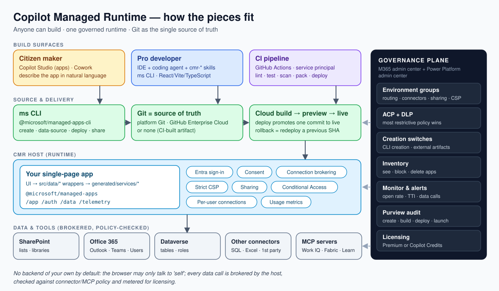

# Copilot Managed Runtime skills

Skills, agents and a guard hook that help AI coding agents (GitHub Copilot CLI, Copilot in VS Code, Claude Code and others) build **governed, distributable apps on Microsoft Copilot Managed Runtime (CMR)**. They cover the work from a first `ms app create` through governance, ALM and production review.



> **Status:** community project, not an official Microsoft product. CMR is in **preview**, so commands, policies and limits will change. The guidance was checked hands-on with `ms` CLI **0.27** in a test tenant, and every skill tells the agent to confirm flags with `ms <command> --help`. All examples are anonymised (`contoso`, `<tenant-id>`, `<environment-id>`).

## Why these skills

CMR runs single-page apps (React/Vite/TypeScript or any framework) on a Microsoft-hosted runtime. That runtime handles Entra sign-in, connector and MCP brokering, Content Security Policy, sharing, Conditional Access and tenant policy (ACP/DLP). It is easy to scaffold an app. It is much harder to get these right:

- **Pick the right delivery model.** The options are a platform repo, external GitHub, or CI-built artifacts (`--repo none`), plus the `MS_CLI_ALM` test/prod stages.
- **Stay inside policy.** That means connector and MCP allow-lists, sharing limits, CSP, and the environment-group routing set by admins.
- **Keep generated code generated.** Wrap `generated/services/*` behind `src/data/*`; never hand-edit them.
- **Hand over cleanly.** A citizen maker starts an app in Copilot Studio or Cowork; a pro developer takes over the source and can give it back.
- **Avoid the 44 known anti-patterns.** These are catalogued with fixes in [`anti-patterns.md`](plugins/copilot-managed-runtime/references/anti-patterns.md).

These skills package that knowledge so a coding agent can follow it step by step.

## What's inside

```
plugins/copilot-managed-runtime/
├── skills/        16 skills (cmr-*) — see table below
├── references/    8 shared reference docs the skills link to
├── agents/        cmr-architect, cmr-reviewer
└── hooks/         PreToolUse guard that blocks edits to generated code
```

| Skill | Use it to… |
|---|---|
| `cmr-overview` | Get oriented and route to the right skill |
| `cmr-setup-auth` | Install the `ms` CLI, sign in, and set up CI identities |
| `cmr-create-app` | Create or register an app with the right repo model and environment |
| `cmr-inner-loop` | Go dev → pack → push → build → preview → deploy → play, and roll back |
| `cmr-data-sources` | Bind connectors (SharePoint, Office 365, SQL…) and wrap generated services |
| `cmr-dataverse` | Work with Dataverse tables, cross-environment binding and security roles |
| `cmr-mcp-workiq` | Call MCP servers (Work IQ and others), including JSON-RPC and SSE parsing |
| `cmr-sdk-patterns` | Use `@microsoft/managed-apps` idiomatically: context, results, telemetry |
| `cmr-security-csp` | Live within the CSP and avoid XSS and secret leaks |
| `cmr-alm-cicd` | Set up branching, test/prod stages, and GitHub Actions with service principals |
| `cmr-sharing` | Share with groups at the right access level |
| `cmr-citizen-handoff` | Take over a Copilot Studio or Cowork app as pro-code, and hand it back |
| `cmr-governance-admin` | Manage environment groups, ACP/DLP, sharing limits, CSP, inventory and audit |
| `cmr-licensing-cost` | Understand licensing paths and Copilot Credits, and design with cost in mind |
| `cmr-troubleshooting` | Diagnose CLI, git, binding, build, CSP, licence and policy errors |
| `cmr-review` | Run a production-readiness review against the anti-pattern catalogue |

Full details: [plugin README](plugins/copilot-managed-runtime/README.md). Visual explainers: [docs](docs/README.md).

## Install

### GitHub Copilot CLI / Claude Code (plugin, includes the hook)

```text
/plugin marketplace add vademche/copilot-managed-runtime-skills
/plugin install copilot-managed-runtime@copilot-managed-runtime-skills
```

Or load the plugin straight from a clone: `copilot --plugin-dir ./plugins/copilot-managed-runtime`.

### VS Code (GitHub Copilot), Cursor and other agents (skills only)

Copy the skills and their shared references into the folder your agent reads skills from. The two folders must sit side by side, because the skills link to `../../references/`.

```bash
git clone https://github.com/vademche/copilot-managed-runtime-skills
node copilot-managed-runtime-skills/scripts/install.mjs .github            # per repo, VS Code
node copilot-managed-runtime-skills/scripts/install.mjs ~/.copilot         # per user, Copilot CLI
node copilot-managed-runtime-skills/scripts/install.mjs .claude --agents   # per repo, Claude Code + agents
```

The script copies files only (no network access, no telemetry) and refuses to overwrite existing files unless you pass `--force`.

### Works well with Microsoft's plugin

Microsoft publishes `microsoft-managed-apps` in [`microsoft/Managed-Apps`](https://github.com/microsoft/Managed-Apps) for the core scaffolding commands. Install both: these skills add architecture, governance, ALM, security, cost and handoff guidance on top.

## Try it

After installing, ask your agent things like:

- "Create a CMR app that lists open items from the *Projects* SharePoint list, with a CI/CD pipeline to test and prod."
- "Our citizen maker built this app in Copilot Studio. Take it over, add Dataverse, and keep it editable by them."
- "Review this CMR repo for production readiness."
- "As tenant admin, which policies should I set before makers start building CMR apps?"

## Contributing

See [CONTRIBUTING.md](CONTRIBUTING.md). Run `node scripts/validate.mjs` before you open a PR. It checks manifests, skill frontmatter, links and anti-pattern IDs, and scans for real tenant identifiers.

## License

[MIT](LICENSE). Product names belong to their respective owners.
