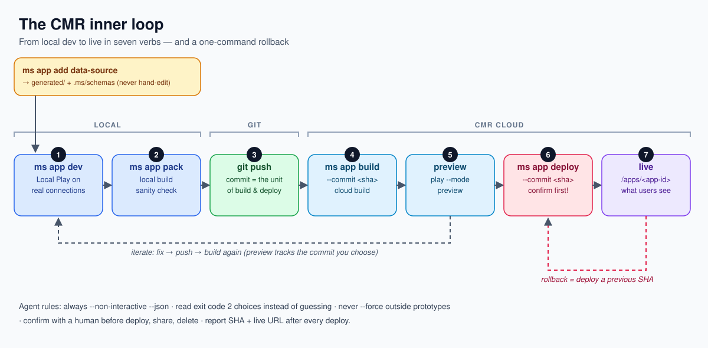
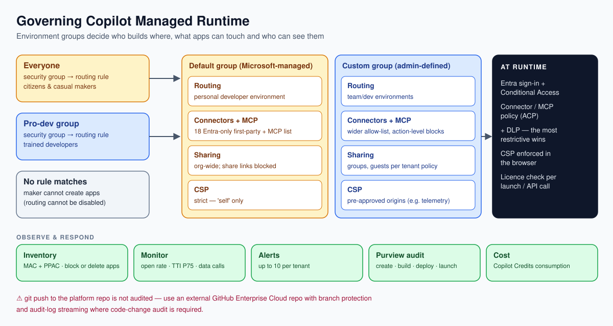
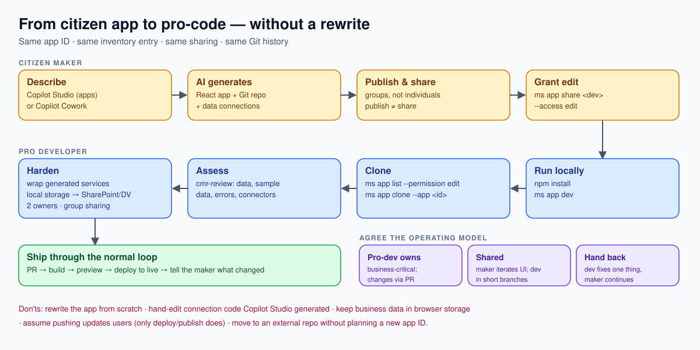
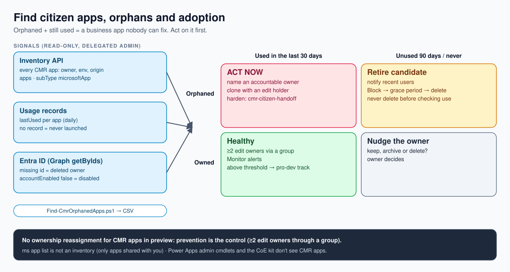
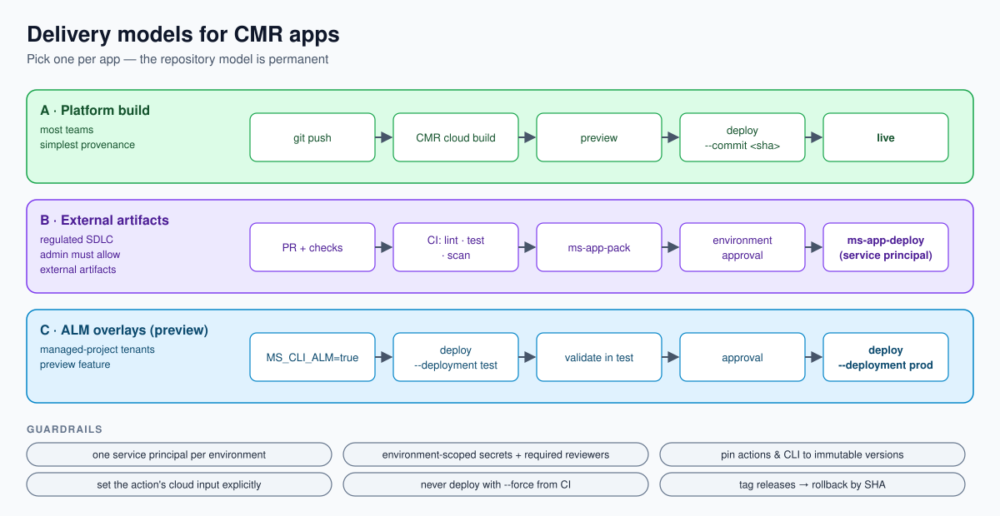

# Copilot Managed Runtime in pictures

Five diagrams covering the concepts the skills rely on, plus a [map of the skills across the lifecycle](images/cmr-skills-map.svg). The SVG sources are in [`images/`](images/).

## 1. Architecture

- Your app is a static SPA. UI components call **your own wrappers** in `src/data/*`. Those wrappers call the **generated, typed services** in `generated/services/*`, which call the `@microsoft/managed-apps` SDK.
- The **CMR host** handles sign-in, consent, connection brokering, CSP, sharing, Conditional Access and tenant policy. You don't write any of that yourself.
- All data goes through **connectors and MCP servers** using the signed-in user's own connections. The browser can only reach `'self'`, so there is no direct `fetch` to external APIs.

Skills: `cmr-overview`, `cmr-sdk-patterns`, `cmr-data-sources`, `cmr-security-csp`.

## 2. Inner loop

`ms app dev` (local code served through the hosted *Local Play* URL, so you get real auth, connections and policies) → `git push` → `ms app build --commit <sha>` (cloud build from a commit) → `ms app play --mode preview` → `ms app deploy --commit <sha>` → live. To roll back, deploy an earlier SHA. Builds are immutable, so the commit is the unit of release.

Skill: `cmr-inner-loop`.

## 3. Governance

Admins attach makers' developer environments to an **environment group**. The group's rules control which connectors and MCP servers are allowed, how widely apps can be shared, the CSP, and where new apps are routed. Data policies (ACP/DLP) are checked when a maker adds a data source and enforced by the service on every deploy. Custom and third-party connectors are blocked in the default group. Agents should read the policy, design within it, and **never try to get around it**.

Skills: `cmr-governance-admin`, `cmr-sharing`, `cmr-licensing-cost`.

## 4. Citizen → pro-dev handoff

An app a maker builds in Copilot Studio or Cowork is an ordinary Git-backed CMR app. The developer gets *edit* access, clones it, assesses it, and hardens it (shared data store, error handling, tests, CI). The app ID, inventory entry and sharing stay the same, so the maker keeps using the same app. Continue the app; don't rewrite it.

Skill: `cmr-citizen-handoff`.

## 4b. Finding citizen apps, orphans and adoption

`ms app list` only shows apps shared with you, so it can't tell an admin what citizens have built. Three read-only signals can: the **Power Platform inventory API** (every CMR app, with its owner, environment and origin), the inventory's **usage records** (last day each app was used), and **Entra ID** (is the owner deleted or disabled?). Joined, they give a 2×2 matrix. The top-left cell, orphaned but still used, is a business app nobody can fix, and it comes first. CMR apps have no ownership reassignment in preview, so prevention (two edit owners through a group) is the real control.

Skill: `cmr-governance-admin` (script `Find-CmrOrphanedApps.ps1`). Reference: [inventory-orphans-adoption](../plugins/copilot-managed-runtime/references/inventory-orphans-adoption.md).

## 5. ALM and CI/CD

There are three delivery models:

- **Platform build**: push to the app's repo; the cloud builds from a commit.
- **External artifacts**: CI builds the app and deploys it with `--repo none`. This needs the admin setting `AllowExternalArtifactDeployment`.
- **Staged ALM**: with `MS_CLI_ALM=true`, `--deployment test|prod` gives you separate test and production stages.

CI signs in as a service principal. Gate prod behind an environment approval.

CMR apps are not solution components, so Git is their source of truth. If the app binds to Dataverse tables, ship that schema as a **managed solution** from the same repo and import it *before* you deploy the app commit. Script SharePoint lists and Planner plans the same way; the app creates content, not containers.

Skills: `cmr-alm-cicd`, `cmr-backend-provisioning`.
