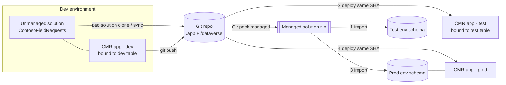

# Dataverse solutions and CMR apps: managed vs unmanaged, and how they relate to Git

**Short answer:** for any app that uses Dataverse, **yes, you need both.**
- **Git** (platform-managed repo or GHEC) is the source of truth for the **app**.
- A **Dataverse solution** carries the **schema** the app depends on. It's unmanaged in dev and **managed** downstream.
- Its unpacked source sits in the **same Git repo** next to the app.

For an app that uses only Microsoft 365 data (SharePoint, Planner, Outlook, …), there's no solution. Use idempotent provisioning scripts in the repo instead ([backend-provisioning](backend-provisioning.md)).

## 1. Four things with similar names

| Thing | What it is | Holds the CMR app? | Where it lives |
|---|---|---|---|
| **Git repo** (`native` / `github` / `none` + artifacts) | Source of truth for app code, `ms.config.json`, `generated/` | **Yes**, the only home | Platform Git or GHEC |
| **Unmanaged solution** | Editable dev container for Dataverse components (tables, choices, roles, flows, env vars, connection refs) | **No.** CMR apps aren't solution components | Dev environment |
| **Managed solution** | Sealed, versioned build of that solution. Imported as a unit, upgraded or uninstalled as a unit | **No** | Test / prod environments |
| **CMR "managed project"** (preview, `MS_CLI_ALM`) | CMR's own grouping of an app across `test`/`prod` deployments (`ms.project.config.json`, `/managedprojects` API) | Yes, as deployments of one app | CMR service |

The CMR docs say "the Git repository is the single source of truth" and never mention solutions. CMR apps are inventoried in the M365 / Power Platform admin centers and governed by environment-group rules, not by solution layering. A *managed project* has nothing to do with a *managed solution* (AP-39).

**Contrast: Power Apps code apps** *are* solution-aware. They support `pa app push --solution-id`, preferred-solution auto-selection, connection references and environment variables in data sources, and Power Platform Pipelines. They don't support Git. Don't carry that model over to CMR (AP-01). The CMR config schema inherits fields such as `xrmConnectionReferenceLogicalName` and `datasetOverride.environmentVariableName` from shared code, but **no `ms` command sets them**. Don't hand-edit them in (AP-10).

## 2. Managed vs unmanaged: what each is for

| | Unmanaged | Managed |
|---|---|---|
| Purpose | Development | Distribution / deployment |
| Editable in the target | Yes (and that's the problem downstream) | Components are locked (configurable via managed properties) |
| Uninstall | Removes the container only; components stay | Removes all of its components (and data) as a unit |
| Upgrade / versioning | No real upgrade semantics | `version`, upgrade/patch, holding-solution, stage-and-upgrade |
| Use in | **Dev only** | **Test, prod, every downstream environment** |

Rules:
1. Build schema in an **unmanaged** solution in dev, under a **custom publisher prefix** (`contoso_`).
2. Export as **managed** for every other environment. Never import unmanaged into prod (AP-37).
3. In prod, turn on **Block unmanaged customizations** (Managed Environments) so nobody "hot-fixes" schema in prod.
4. Keep the **unpacked** solution in Git (`pac solution clone` / `export` + `unpack`) so schema changes go through PR review like code.

## 3. Why managed solutions matter specifically for CMR

The generated code (`generated/`, `.ms/schemas/`) contains **no environment-specific values**, which was verified in the lab. The org URL, environment ID and site URL appear only in `ms.config.json` bindings. So **one commit of generated code works in every environment *if* the schema is byte-identical**: same logical names, entity-set names, column types and **choice values**. A managed solution is how you guarantee that. Recreating tables by hand in test or prod yields different prefixes or option values, breaks the typed choice maps, and forces divergent codegen per environment (AP-38).

## 4. Repo layout

```
/app/                            # CMR app (ms.config.json [+ ms.<deployment>.config.json], src/, generated/, .ms/schemas/)
/dataverse/ContosoFieldRequests/ # pac solution clone output: .cdsproj + src/ (tables, choices, roles, optional flows)
/dataverse/settings/test.json    # deployment settings (only if the solution has flows/env vars/connection refs)
/provisioning/                   # SharePoint/Planner/Graph scripts (no solution equivalent)
/.github/workflows/release.yml
```

## 5. Release order and environments



1. **Schema first.** Import the managed solution into the target, then deploy the app commit bound to that environment's table. The reverse order fails at runtime on missing columns.
2. **Rebind once per environment.** Bindings are keyed to the org API URL and environment ID, so each environment needs its own binding: a separate app per stage, or a `--deployment` overlay where managed projects are available (`cmr-alm-cicd`). After rebinding, the `generated/` diff must be empty. If it isn't, the schemas have drifted.
3. **Additive (expand/contract) changes.** Add new columns in release N, start using them in the app in N, and remove old columns only in N+1 after every app version that reads them has been retired. App rollback is "redeploy the previous SHA". Managed solution rollback isn't instant, so destructive schema changes must never ride along with a risky app change.
4. **Security roles in the solution.** Persona roles (least privilege) travel with the schema. Assign them to Entra groups (group teams) per environment.
5. **Pipelines.** Power Platform Pipelines or `microsoft/powerplatform-actions` can promote the **solution**. The **app** still goes through `ms app deploy` or the `ms-app-deploy` action. They're two tracks in one workflow.

## 6. GitHub Actions sketch (two tracks, one workflow)

```yaml
name: release
on: { push: { tags: ['v*'] } }
permissions: { contents: read }
jobs:
  schema:
    runs-on: windows-latest            # pac pack/unpack runs on windows/ubuntu; pin per action docs
    environment: test
    steps:
      - uses: actions/checkout@v5
      - uses: microsoft/powerplatform-actions/actions-install@v1          # pin to a SHA
      - uses: microsoft/powerplatform-actions/pack-solution@v1
        # `pac solution clone` output already contains the *_managed.xml variants, so packing Managed works (lab-verified)
        with: { solution-folder: dataverse/ContosoFieldRequests/src, solution-file: out/ContosoFieldRequests_managed.zip, solution-type: Managed }
      - uses: microsoft/powerplatform-actions/import-solution@v1
        with:
          environment-url: ${{ vars.TEST_DATAVERSE_URL }}
          app-id: ${{ secrets.PP_SP_CLIENT_ID }}
          client-secret: ${{ secrets.PP_SP_CLIENT_SECRET }}
          tenant-id: ${{ secrets.PP_SP_TENANT_ID }}
          solution-file: out/ContosoFieldRequests_managed.zip
          stage-and-upgrade: true
          run-asynchronously: true
  app:
    needs: schema                      # schema before app
    runs-on: ubuntu-latest
    environment: test
    steps:
      - uses: actions/checkout@v5
      # … install-ms-cli / ms-app-pack / ms-app-deploy exactly as in cmr-alm-cicd, working-directory: app,
      #    targeting the test app (separate app ID or --deployment test overlay)
```

Repeat the pair for `prod` with a GitHub environment that requires reviewers. The service principal needs an application user in each Dataverse environment (System Customizer or a custom role for import) and CMR deploy rights (`cmr-setup-auth`).

## 7. Inner loop for schema changes

```bash
# 1. change the schema in DEV (maker portal *inside the solution*, or Web API with MSCRM.SolutionUniqueName)
# 2. pull it into Git
pac solution clone --name ContosoFieldRequests --outputDirectory dataverse   # first time (.cdsproj + src/, managed+unmanaged variants)
pac solution sync  --solution-folder dataverse/ContosoFieldRequests          # afterwards
# 3. refresh the app's typed code
cd app && ms app refresh data-source -n contoso_fieldrequest --non-interactive --json
# 4. one PR with both diffs: dataverse/** and app/generated/**
```

## 8. Checklist

- [ ] Custom publisher; no components in the Default solution.
- [ ] Unmanaged in dev only; managed everywhere else; "Block unmanaged customizations" on in prod.
- [ ] Solution source in the same repo as the app; schema and codegen diffs reviewed in one PR.
- [ ] Release = import managed solution, then deploy the same app SHA; `generated/` diff is empty after rebinding.
- [ ] Expand/contract for destructive changes.
- [ ] Nobody (people, agents, MCP tools) changes schema in test or prod directly.

Anti-patterns: AP-31, AP-34, AP-37, AP-38, AP-39, AP-52. See [anti-patterns](anti-patterns.md).
